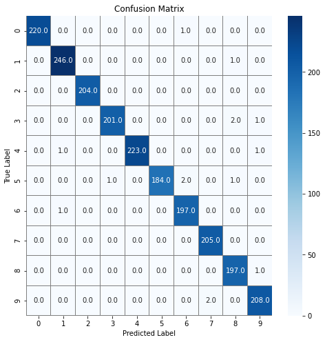

# Kaggle Project: Digit Recognition using a Convolutional Neural Network
The MNIST dataset is heralded as the "Hello World!" dataset of computer vision. The goal of this project is to recognize digits (0-9) using a training set of 42,000 handwritten images from the MNIST dataset. To achieve this objective, I built a convolutional neural network (CNN) using Keras.
  
   
  

# Acknowledgements
https://www.kaggle.com/kshitijkarnawat/basic-3-layer-neural-network
https://www.kaggle.com/kanncaa1/convolutional-neural-network-cnn-tutorial

# Methods
1) Exploratory data analysis of training data
2) Prepare data (reshaping, feature normalisation)
3) Build Convolutional Neural Network using Keras
4) Generate predictions on validation set and evaluate model (confusion matrix and accuracy score)
5) Generate predictions on test set

# Results
The classification accuracy on the test set exceeds 99%. This placed me in the top 35% of all competition participants. As seen from the confusion matrix below, most images are classifier correctly. 

# Applications and Future Work
Convolutional neural networks are useful in training very complex features that are useful for computer vision. Ideas from this project can be extended to other object recognition / classification tasks including ID authentication, autonomous vehicles and tumour detection.
